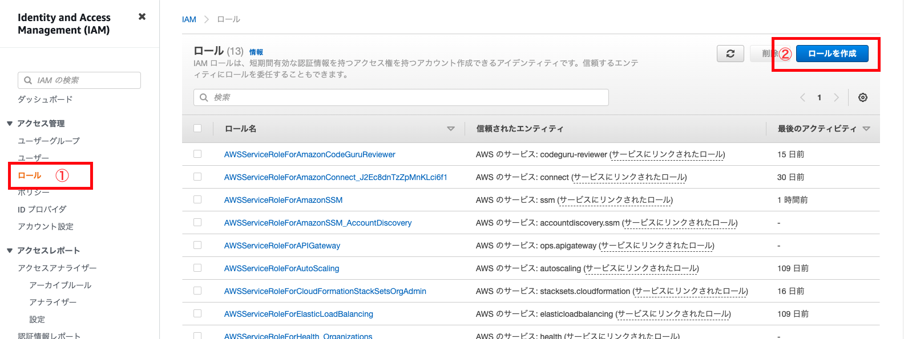
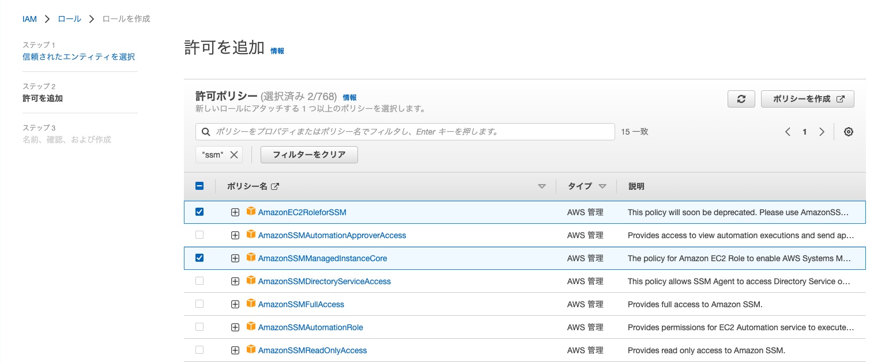
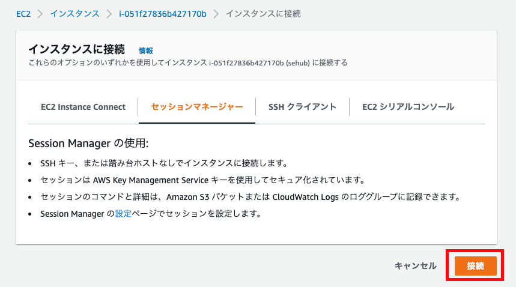

---
---

# EC2 インスタンスに接続

## SSH で接続
::: tip
キーペアファイルの権限が open すぎるとエラーになるので、`600` 権限で十分でしょう。

`XXXX.pem` はインスタンス起動時指定したキーペアです。
:::

```bash
chmod 600 XXXX.pem
ssh -i XXXX.pem ec2-user@EC2インスタンスのIPアドレス
```

## SSM 接続

### amazon-ssm-agentサービス起動
SSM 接続は `amazon-ssm-agent` サービスが必要です。
::: tip
最新のバージョンでは `amazon-ssm-agent` サービスがインストールされているし、自動起動に設定されています。
:::
```bash
service amazon-ssm-agent start
```
再起動しても自動起動するように設定します。

```bash
chkconfig amazon-ssm-agent on
```

### SSM ロール作成
1. 「IAM」⇒「ロール」を開く

1. 「ロールを作成」押下

      

1. 信頼されたエンティティを選択

      信頼されたエンティティタイプは `AWS のサービス` を選択

      ユースケースは `EC2` を選択

      「次へ」押下

1. 許可を追加

      `SSM` で検索して、`AmazonEC2RoleforSSM` と `AmazonSSMManagedInstanceCore` を選択

      

      「次へ」押下

1. 名前、確認、および作成

      ##### ロール名
      自由に設定すればいい、一旦 `SSM` にします。

      ほかの設定はデフォルトでOKなので、そのまま「ロールを作成」押下

### EC2インスタンスにSSMロール追加
1. 「IAM ロールを変更」開く

      

1. ロール更新

      作成した SSM ロールを選択して、「ロールの更新」押下

      

### AWS Systems Manager セットアップ

1. 「Systems Manager」⇒「高速セットアップ」を開く

      

2. Host Management の「作成」押下

      全部デフォルトでいいので、そのまま「作成」ボタン押下

### EC2 インスタンスに接続


`セッションマネージャ` タブの「接続」ボタン押下



正常にログインできるはず、お楽しみに！
