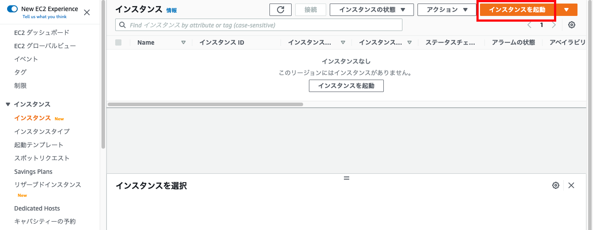
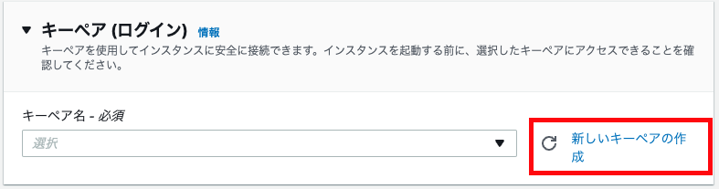
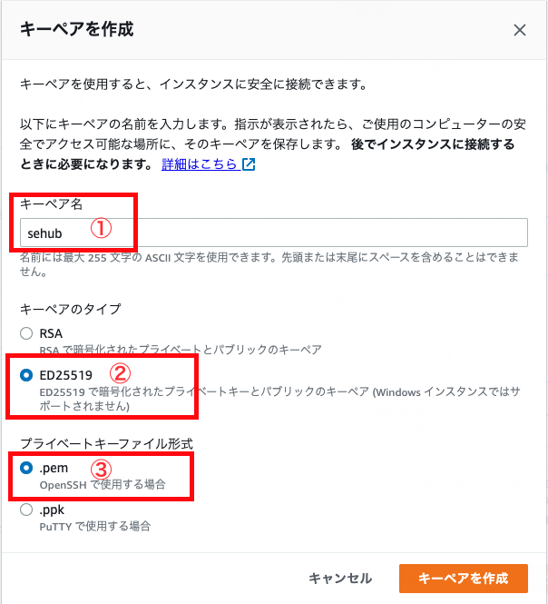
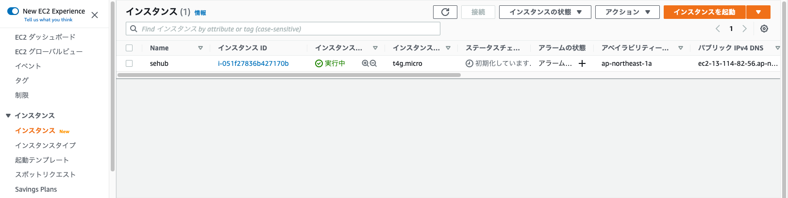

---
---

# EC2 の開始方法

## インスタンスを起動
### 「インスタンスを起動」ボタン押下

## 設定値
### 名前とタグ
自由に設定すればいい。

### アプリケーションおよび OS イメージ (Amazon マシンイメージ)
自分に合うイメージを選択しましょう。

今回は最新の Amazon Linux 2023 にします。
::: tip
安くて性能がいいので、今回は `Arm` バージョン使います
:::

### インスタンスタイプ
今回は比較的に安い `t4g` を使います。

### キーペア (ログイン)
::: tip
最新のバージョンでは `amazon-ssm-agent` 既にインストールされているのでこの手順がなくても大丈夫です。
:::

SSM（AWS Systems Manager）を使ってキーなしでもいいですが、SSHツールなど使う場合、キーを作ったほうがいいです。
既存キーがない場合は、「新しいキーペアの作成」で新しいキーペアを作成します。

#### キーペア作成
1. 「新しいキーペアの作成」押下

1. 詳細設定
    1. キーペア名
    
        自由に設定すればいい。
        
    1. キーペアのタイプ
    
        どちらでもいい、新しい `ED25519` にします。
        
    1. プライベートキーファイル形式

        `PuTTY` 使わないので、`.pem` にします。

        `PuTTY` を使う場合は `.ppk` にしましょう。

        

        こんな感じ、「キーペアを作成」押下で新しいキーペアをダウンロードします。

### ネットワーク設定
::: tip
「編集」押下で編集可能な状態になる
:::

* VPC

    [VPC の開始方法](/aws/vpc/new-vpc) で作成したVPCを選択
    
* サブネット

    外部からアクセスする必要なので、`public` のサブネットを選択しましょう。
    
* パブリック IP の自動割り当て

    `有効化` にしましょう。
    
* IPv6 IP を自動で割り当てる

    `有効化` にしましょう。
    
* ファイアウォール (セキュリティグループ)

    `セキュリティグループを作成する` と `既存のセキュリティグループを選択する` どちらでもいい。
    
* インバウンドセキュリティグループのルール
    
    デフォルトで `ssh` できるように `22` ポート許容になっているので、最低限これでいいでしょう。（ほかは起動後追加可能）
    
その他の設定はとりあえずデフォルトでインスタンスを起動します。

起動後、下記のように表示されます。
    
