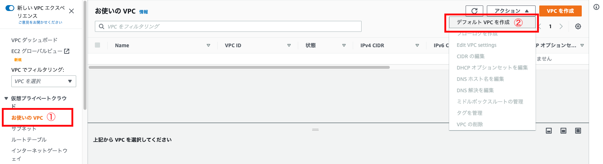
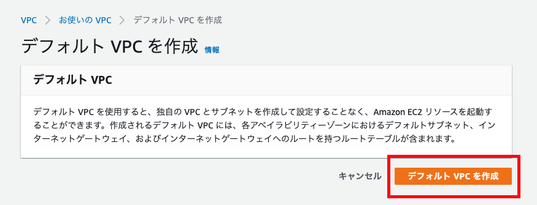
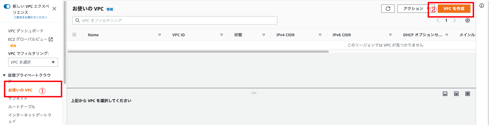
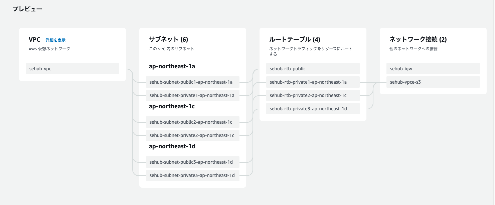
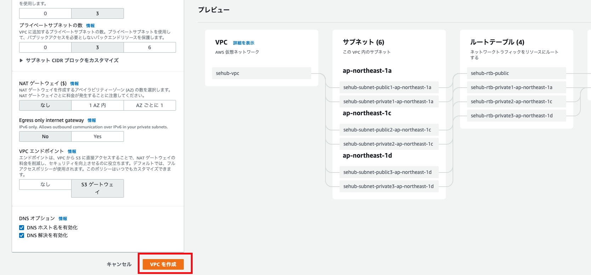

---
---

# VPC の開始方法

## デフォルトのVPCの作成方法
最初、デフォルトのVPCが既に作成されていますが、削除してしまった場合は再作成することができます。
作成方法は下記となります。

### 「お使いのVPC」に移動
サイドバーにある「お使いのVPC」をクリック

### 「デフォルト VPC を作成」クリック
「アクション」⇒「デフォルト VPC を作成」をクリック

### 作成完了
「デフォルト VPC を作成」をクリックすることでデフォルト VPC が作成されます

## デフォルトのVPC以外のVPCの作成方法方法
### 「VPC を作成」クリック
「VPC」⇒「お使いのVPC」⇒「VPC を作成」で設定画面が表示されます

### 作成するリソース
サブネットなど、EC2を作成する時必要なので、「VPCなど」を選択

### 名前タグの自動生成  
サブネットなどの名前の先頭に追加する文字列、自由に設定すればいい

### IPv4 CIDR ブロック  
IP4 の IP とサイズを決定する。
サイズは16〜28設定可能、デフォルトの16でいいでしょう。

### IPv6 CIDR ブロック
なくてもいいけど、あったほうがいいと思うし、無料だから、「Amazon 提供の IPv6 CIDR ブロック」を選択しましょう。

### テナンシー
「デフォルト」でいいでしょう。  

### アベイラビリティゾーン (AZ) の数  
可用性を高めるため、2以上必要ですが、一番多い「3」にしましょう。

### パブリックサブネットの数
「3」にしましょう。

### プライベートサブネットの数  
パブリックサブネットより多く設定したほうがいいと思いますが、同じく「3」で十分でしょう。

### NAT ゲートウェイ ($)
デフォルトの「なし」にします。

### Egress Only インターネットゲートウェイ
デフォルトの「いいえ」にします。

### VPC エンドポイント  
S3を操作する可能性があるので、「S3ゲートウェイ」にしましょう。

### DNS オプション  
デフォルトで全部チェックが入ってるので、そのままにしましょう。

プレビューは下記となります。

### 作成完了
「VPC を作成」をクリックして作成完了です

