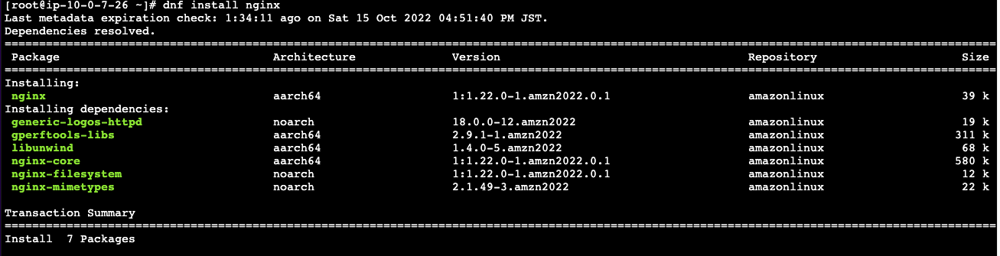
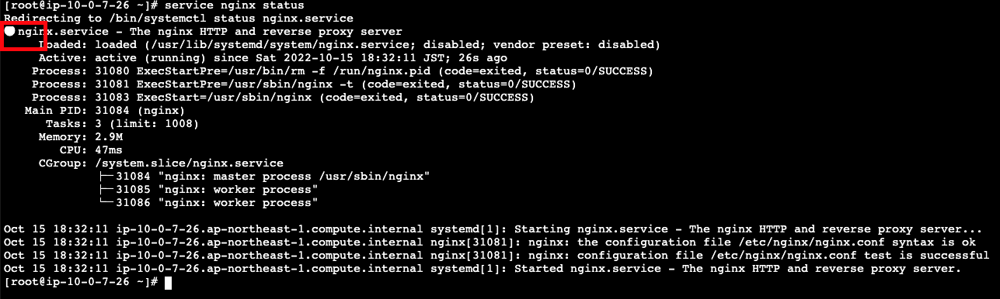
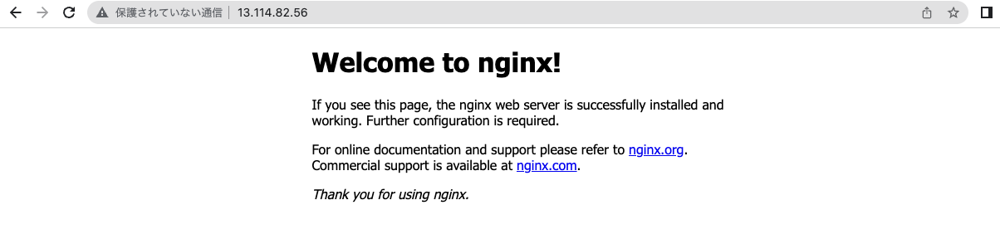

---
---

# Nginx セットアップ

## インストール
```bash
dnf install nginx
```



現時点で `1.24` バージョンになっています

## 起動
### Nginx サービスを起動
```bash
service nginx start
```

### Nginx サービス状態確認
```bash
service nginx status
```


::: tip
`●` が表示されたら、正常動いている状態。

`○` が表示されたら、起動していない状態。
:::

### ブラウザで Nginx の状態確認

ブラウザから EC2 インスタンスのアドレスをアクセスして、下記のような画面が表示されたら、OK.



::: tip
`https` はまだ未設定なので、`http` しか表示できません。
:::

### Nginx サービスを自動起動に設定
```bash
chkconfig nginx on
```